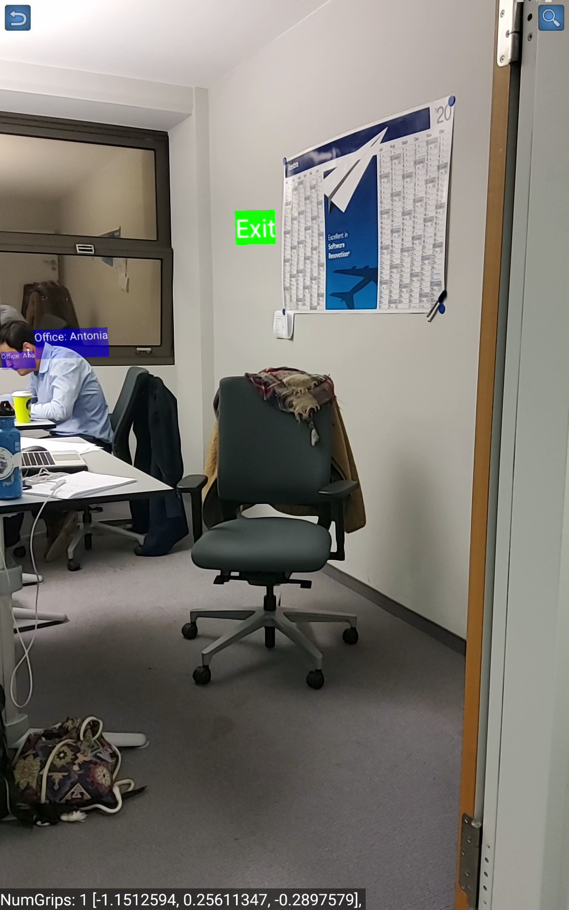

# AlejaAR - Indoor Guidance System using Augmented Reality 

## Overview 

### What's AlejaAR?
AlejaAR is an Android application, that provides indoor navigation and mapping services using Augmented Reality.

Please follow the guidelines below.


## Installation
There are two options to install the app.

#### Option 1: Install the release version on the smartphone
The app is developed for Android 7.0 (API Level 24, Nougat) or higher. To use the app you need a smartphone 
that is supported by ARCore (https://developers.google.com/ar/discover/supported-devices#android_play).

To install the app simply download the app/release/app-release.apk file. Since this is not a trusted source, you have to allow the installation for unknown apps and sources.
* On devices running Android 8.0 (API level 26) and higher, users must navigate to the Install unknown apps system settings screen to enable app installations from a particular source.
* On devices running Android 7.1.1 (API level 25) and lower, users must either enable the Unknown sources system setting or allow a single installation of an unknown app.

#### Option 2: Clone this repository and build your own APK using **Android Studio**

```bash
git@github.com:abamrz/aleja-ar.git
```

##### Configuration to build a release APK
###### Keystores:
Create `app/keystore.gradle` with the following data:
```gradle
ext.key_alias='...'
ext.key_password='...'
ext.store_password='...'
```
Then place both keystores under `app/keystores/` directory.


###### Build variants
Use the Android Studio *Build Variants* button to select release build.


###### Generating signed APK
From Android Studio:
1. ***Build*** menu
2. ***Generate Signed APK...***
3. Fill in the keystore information *(you only need to do this once manually)*

## How to use the app? 
### Step 1: Start the app  


From here you can choose between navigation (Use an existing plan) and making an own new plan of a specific place or floor (Make a new plan). 
On navigation you can search for a desired destinations or simply look around and inspect the labeling of all information points saved on the map.
When making a new plan you can build up a graph and add information to points of interest.

The two options are described in detail in the following parts.

### Step 2: Make a new plan

* Click the **Make Plan** button on the starting page
* This is the screen to make a new plan:
  

#### Functionality of the buttons
* **Add to Branch**: Adds a new node to the graph at the current position of the smartphone. This node is connected to the previously added node.
* **New Branch**: Adds a new node to the graph at the current position of the smartphone. This node is connected to the closest edge. The connection point to the edge is shown by a red ball.
* **Close Circle**: Adds an edge from the last added node to the point at the closest edge which is again identified by a red ball.
* **Set Attributes**: Opens a dialog to change the attributes to the closest node to the current smartphone position. The attributes are
    - the label: title of the information at this point (e.g. "office of christian")
    - the type: the kind of object the point refers to (e.g. kitchen). The type waypoint is used for points that are only used to navigate along, but should not provide any information.
    - the description: only available, when the type is "office". Can be used to add some more information to an office node.
* **Save Graph**: A dialog is shown to save the graph with an arbitrary name that can be chosen by the user. This name is later used to load the graph to navigate with it.
* **Anti Schlabber**: This option deletes the graph, so that the user can start over.

**Note**: You should scan some markers (ar_pattern*.png) to have a reference to the real world.

### Step 3: Use an existing plan

* After you clicked on the **Use Existing Plan** button, you have to select a desired plan that was previously stored.  
This plan is than loaded with all the information needed and enables navigation in the building where the plan was recorded.
* After the plan is loaded you end up with the following screen:
  
* Now you should scan at least one marker to reference your position.
* When the navigation is possible, a search button in the upper right corner is shown.
* When looking around the different information at each point is displayed and you can discover the floor on your own by walking around.
* When you want to navigate to a specific location you can press the search button.  
You can search for the type or the label of the desired target location. By focusing the textview all possibilities are listed.  
When searching for a type, the navigation will lead you to the closest point with this type.
* By following the balls the goal can be reached. If you want to end the navigation earlier you can cancel it by pressing the x in the upper right corner.

**Note**: The steps 1-3 should be followed in strict order during the first launch of the app, i.e. should you not have any plan (graph) in the database, you have to create a new plan (step 2) first.

## Add more marker
We are using three marker:
* [pattern 1] [./ar_pattern1.png]
* [pattern 2] [./ar_pattern2.png]
* [pattern 3] [./ar_pattern3.png]  
To add more patterns:
* Add the pattern to the drawable folder
* In CustomArFragment.class
    - include the marker like ```java Bitmap bitmap3 = BitmapFactory.decodeResource(getResources(), R.drawable.ar_pattern3);```
    - add to the pattern database with ```java aid.addImage("ar_pattern3", bitmap3, 0.16f); ```

## Used Libraries and Frameworks
Library and Frameworks                                                      |
----------------------------------------------------------------------------|
ARCore (https://developers.google.com/ar)                                   |
JGraphT (https://jgrapht.org/)                                              |
SQLite (https://www.sqlite.org/index.html)                                  |


## Developers
This project has been implemented during itestra Coding Camp 2020 by:
* [Antonia](https://github.com/antschum)
* [Lukas](https://github.com/thenxmetti)
* [Erik](https://github.com/TheStealthReporter)
* [Jakob](https://github.com/j-stoll)
* [Aba](https://github.com/abamrz) 


## Contributing

1. Fork it
2. Create your feature branch (git checkout -b my-new-feature)
3. Commit your changes (git commit -m 'Add some feature')
4. Push your branch (git push origin my-new-feature)
5. Create a new Pull Request


